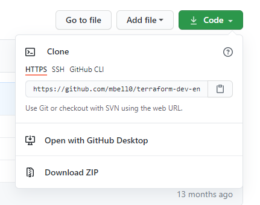

# GitHub - Forking

## Introduction
\
Most DevOps tutorials offer source code so you can follow along and check your work. One thing that really confused me when starting out was how to get a copy of that code into my GitHub and onto my local machine. It sounded so easy but all the new language confused me — forking and repos! This is a tutorial on how to Fork a repository (copy).

## Use Case
\
Get a copy of code (fork) in your repo and onto your machine so you can follow a tutorial. 

## Steps
\
On GitHub navigate to the repo you want to fork.  
\
In the top right of the corner of page , click Fork  
\
You will be taken to your fork  
\
Click Code then copy the HTTPS link under the Clone section

  

On your PC navigate to where you want the cloned directory
Run a cmd in that directory and use the git clone command — i.e. git clone https://github.com/mbell0/terraform-dev-env-azure.git

Then initialise the directory — git init

